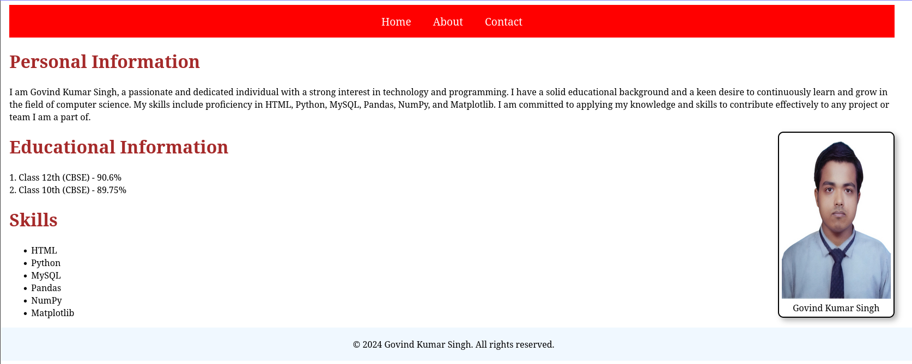
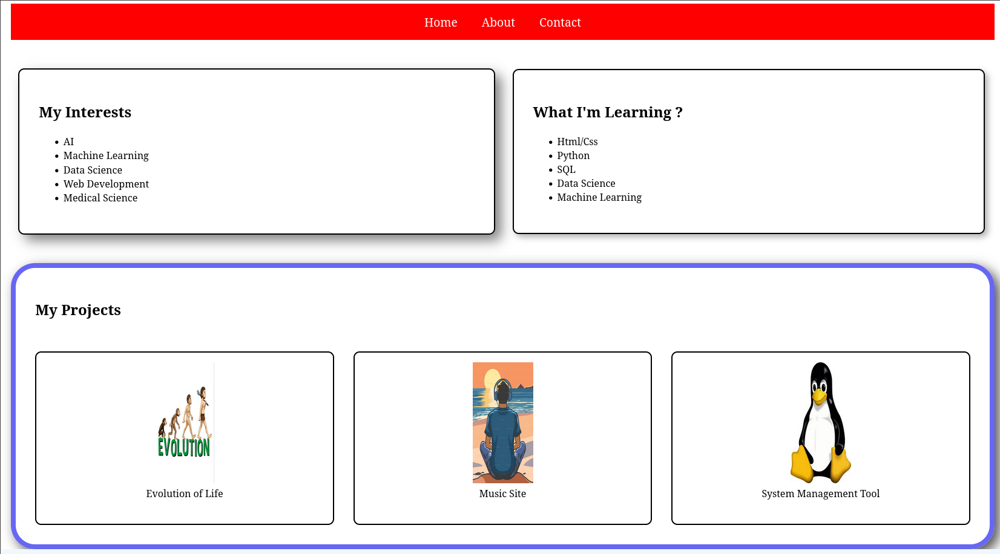
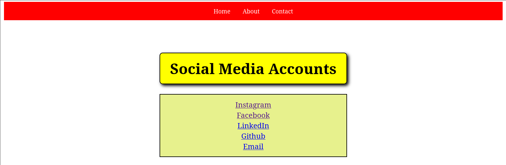

# My Personal Website

## Project Overview
This is my personal portfolio website. I created this in vanilla html and css. It was nostalgia to write code again in html after so many years. 

## Tech Stack used :
- Html
- CSS

### Home Page
**It is divided into three section :**
- Personal information : contains who am i
- Educational Qualification : contains my current educational details
- Skills : tech stacks I have knowledge about

### About
**It is divided into three sections :**
- My interest : describes what I like
- What I am learning : describes my current progression
- My Project : mentions some project which I created on github years ago during school time

### Contact
It mentions my social media accounts. 

## Limitations : 
- Rust of previous knowledge
- CSS skill issue

## License
See `License` page for more details. 

## One last thing
If you read this.....**Thank You!!**
**Love You All 😘😘**

